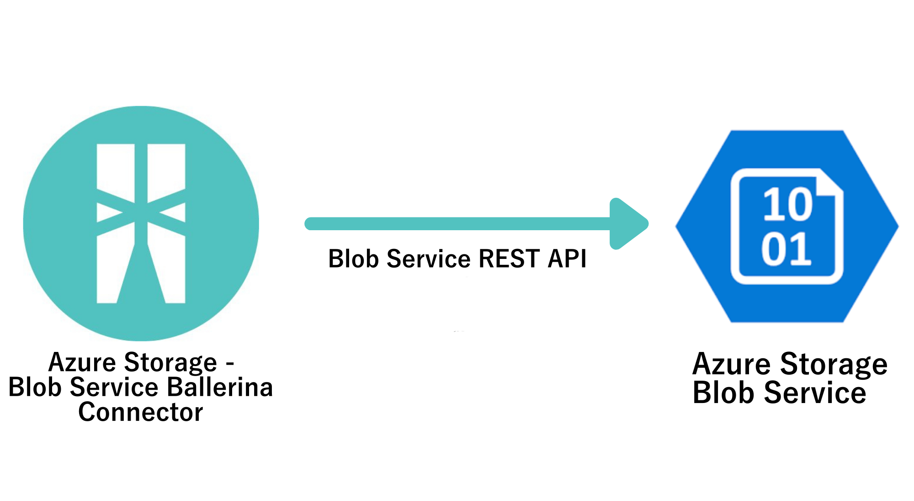

# Ballerina Azure Storage Blob Service Connector

[](https://github.com/ballerina-platform/module-ballerinax-azure-storage-service/actions?query=workflow%3ACI)
[](https://github.com/ballerina-platform/module-ballerinax-azure-storage-service/commits/master)
[](https://opensource.org/licenses/Apache-2.0)


Connects to Azure Storage Blob Service using Ballerina.

# Introduction

## What is Azure Storage Service

[Azure Storage Service](https://docs.microsoft.com/en-us/azure/storage/common/storage-introduction) is a highly 
available, scalable, secure, durable and redundant cloud storage solution form Microsoft. There are four types of 
storage which are Blob Storage, File Storage, Queue Storage and Table Storage.

## Azure Storage - Blobs Service

[Azure Blob Storage Service](https://docs.microsoft.com/en-us/azure/storage/blobs/storage-blobs-introduction) is for storing Blobs which are typically composed of unstructured data such as text, images 
and videos. It provides users with strong data consistency, storage and access flexibility that adapts to the user’s 
needs, and it also provides high availability by implementing geo-replication. 

Blobs are stored in directory-like structures called “containers”. A storage account can include an unlimited number of containers, and a container can store an unlimited number of blobs. The following image shows the relationship between a storage account, container and blobs.


There are 3 categories in Blobs. https://docs.microsoft.com/en-us/rest/api/storageservices/understanding-block-blobs--append-blobs--and-page-blobs
They are 
1. Block blobs.
2. Page blobs.
3. Append blobs. 

Block blobs are optimized for uploading large amounts of data efficiently. This is the commonly used Blob Type to store 
any type of data.

Page blobs are optimized for random read/write operations and which provide the ability to write to a range of bytes in 
a blob. Page blobs are mostly used in virtual machine (VM) storage disks. 

An append blob is comprised of blocks and is optimized for append operations. When you modify an append blob, blocks are added to the end of the blob, via the Append Block operation. Append blob is mostly used for log storage.


# Connector Overview

Azure Storage Blob Service Connector is used to connect to Azure Storage Blob Service via Ballerina language easily. It is capable to connect to Azure Storage Blob Service and to execute operations like listContainers, listBlobs, putBlob, deleteBlob etc. It is also capable of executing management operations such as createContainer and deleteContainer etc.



This connector will invoke the REST APIs exposed via the Azure Storage Blob Service. https://docs.microsoft.com/en-us/rest/api/storageservices/blob-service-rest-api

For the version 0.1.0 of this connector, version 2019-12-12 of Azure Blob Storage Service REST API is used.

# Prerequisites

* Azure Account to Access Azure Portal https://docs.microsoft.com/en-us/learn/modules/create-an-azure-account/

* Azure Storage Account https://docs.microsoft.com/en-us/learn/modules/create-azure-storage-account/

* Java 11 Installed
Java Development Kit (JDK) with version 11 is required.

* Ballerina SL Alpha 5 Installed
Ballerina Swan Lake Alpha 5 is required. 

* Shared Access Signature (SAS) or One of the Access Keys for authentication. 


## Supported Versions

|                      |  Version           |
|----------------------|------------------- |
| Ballerina            | Swan Lake Alpha 5  |
| Azure Storage Service|     2019-12-12     |


# Quickstart(s)

## Simple operations in Azure Blob Service Blob Client.
These are the simplest scenarios in Azure Blob Service Blob Client. You must have the following prerequisites in order 
to obtain these configurations.

* Azure Account to Access Azure Portal https://docs.microsoft.com/en-us/learn/modules/create-an-azure-account/

* Azure Storage Account https://docs.microsoft.com/en-us/learn/modules/create-azure-storage-account/

* You need to get a Shared Access Key or one of the Access Keys from the Azure Portal.


## Step1: Import the Azure Storage Blobs Ballerina Library

First, import the `ballerinax/azure_storage_service.blobs` module into the Ballerina project

```ballerina
    import ballerinax/azure_storage_service.blobs as azure_blobs;
```

## Step2: Create Azure Blob Service Configuration

Create the connection configuration using the Shared Access Signature or Access Key, base URL and account name.

If you are using Shared Access Signature, use the follwing format.

```ballerina
    azure_blobs:AzureBlobServiceConfiguration blobServiceConfig = {
        accessKeyOrSAS: os:getEnv("ACCESS_KEY_OR_SAS"),
        accountName: os:getEnv("ACCOUNT_NAME"),
        authorizationMethod: "SAS"
    };
```

If you are using one of the Access Key, use the follwing format.

```ballerina
    azure_blobs:AzureBlobServiceConfiguration blobServiceConfig = {
        accessKeyOrSAS: os:getEnv("ACCESS_KEY_OR_SAS"),
        accountName: os:getEnv("ACCOUNT_NAME"),
        authorizationMethod: "accessKey"
    };
```

## Step3: Initialize Azure Storage Blob Client 

Create the BlobClient using the configuration you have created as shown above.

```ballerina
    azure_blobs:BlobClient blobClient = check new (blobServiceConfig);
```

## Step4: Try the common operations in Azure Storage Blob Client

1. Get the list of containers in the storage account

```ballerina
    var listContainersResult = blobClient->listContainers();
    if (listContainersResult is error) {
        log:printError(listContainersResult.toString());
    } else {
        log:printInfo(listContainersResult.toString());
    }
```

2. Get the list of blobs from a container using container name

```ballerina
    var listBlobsResult = blobClient->listBlobs("container-1");
    if (listBlobsResult is error) {
        log:printError(listBlobsResult.toString());
    } else {
        log:printInfo(listBlobsResult.toString());
    }
```

3. Upload a blob

```ballerina
    byte[] testBlob = "hello".toBytes();
    var putBlobResult = blobClient->putBlob(containerName, "hello.txt", "BlockBlob", testBlob);
    if (putBlobResult is error) {
        log:printError(putBlobResult.toString());
    } else {
        log:printInfo(putBlobResult.toString());
    }
```

4. Get a blob using container name and blob name

```ballerina
    var getBlobResult = blobClient->getBlob("container-1", "hello.txt");
    if (getBlobResult is error) {
        log:printError(getBlobResult.toString());
    } else {
        log:printInfo(getBlobResult.toString());
    }
```

5. Delete a blob

```ballerina
    var deleteBlobResult = blobClient->deleteBlob("container-1", "hello.txt");
    if (deleteBlobResult is error) {
        log:printError(deleteBlobResult.toString());
    } else {
        log:printInfo(deleteBlobResult.toString());
    }
```

# Samples
More samples are available at:
https://github.com/ballerina-platform/module-ballerinax-azure-storage-service/blob/main/modules/blobs/samples
